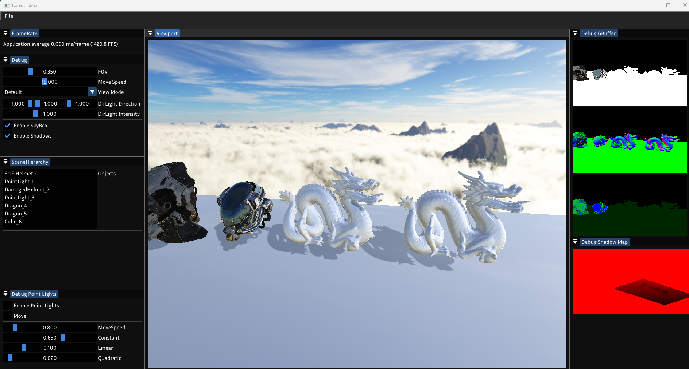

# CorvusEngine
D3D12 Deferred Renderer - Custom C++ Engine

| PBR / IBL |
|---|
|  |

| 100 Point Lights |
|---|
|  |

Features :
* Deferred shading
* Transparency forward pass
* PBR
* IBL
* Instancing
* Directionnal / Point lights
* Lights volumes

RoadMap :
* CSM
* SSAO
* AA (TAA or FXAA)
